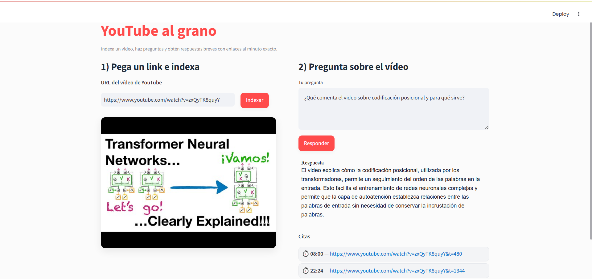
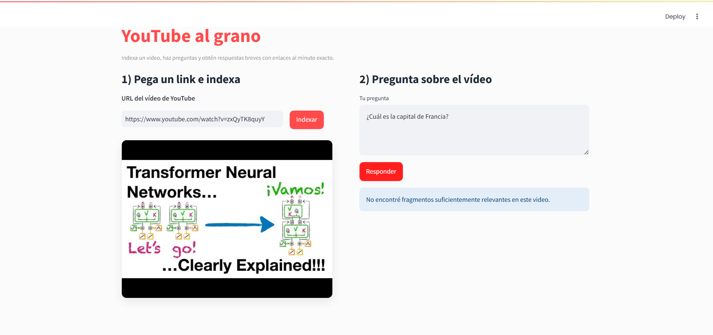

# 🎯 YouTube al grano (YouTube to the point)

Index YouTube videos, ask natural language questions, and get **concise answers with direct citations linked to the exact minute**.  

<p align="center">
  
  
  
  
  
</p>


## 🚀 Features
- **Index YouTube videos** via subtitles (manual & automatic).  
- **Semantic search** with multilingual embeddings (`sentence-transformers/paraphrase-multilingual-MiniLM-L12-v2`).  
- **RAG pipeline** (Retrieval-Augmented Generation) to generate short, grounded answers.  
- **Citations with timestamps**: jump directly to the relevant video moment.  
- **Streamlit UI** with modern design.  


## 🛠️ Tech Stack
- **Frontend / App:** [Streamlit](https://streamlit.io)  
- **Vector DB:** [Pinecone](https://www.pinecone.io)  
- **Embeddings:** [Sentence Transformers](https://www.sbert.net)  
- **YouTube Processing:** [yt-dlp](https://github.com/yt-dlp/yt-dlp) + [youtube-transcript-api](https://pypi.org/project/youtube-transcript-api)  
- **Infra:** Python 3.10, Torch (CPU), dotenv  


## 📂 Project Structure
```
├── app/
│ ├── ingest.py          # Download + segment subtitles
│ ├── embeddings.py      # Embedding generation
│ ├── pinecone_store.py  # Vector DB upsert/query
│ ├── rag_answer.py      # RAG pipeline with citations
│ └── utils.py           # Helpers (yt_id, time links, etc.)
├── data/transcripts/    # Local cache (ignored by git)
├── streamlit_app.py     # UI
├── tests/ # Unit tests
├── requirements.txt
└── README.md
```


## 🖼️ Screenshots
Ask in Spanish

<p align="center"></p>

Ask in English

<p align="center"></p>

Case with no relevant info

<p align="center"></p>

(Screenshots are in /screenshots/ )

## ⚡ Quickstart

```bash
# 1. Clone repo
git clone https://github.com/yourusername/youtube-al-grano.git
cd youtube-al-grano

# 2. Install dependencies
pip install -r requirements.txt

# 3. Add your Pinecone API key
cp .env.example .env
# edit .env with your credentials

# 4. Run Streamlit app
streamlit run streamlit_app.py
```


## 🤝 Why this project?

This app demonstrates how to build a practical RAG pipeline from scratch —without heavy frameworks— combining semantic search, LLMs, and real-time video indexing into a clean interface.
Perfect to showcase:
- **Applied NLP / RAG** skills
- **Full-stack ML engineering** (backend + UI)
- **Cloud-native vector DB (Pinecone)** usage


## 📜 License

This project is licensed under the [MIT License](LICENSE).  
You are free to use, modify, and distribute it with proper attribution.


